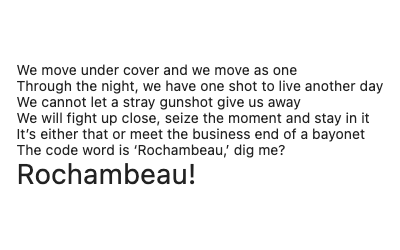
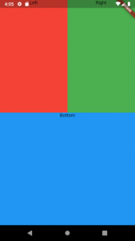

# Column


```dart
Column(
  crossAxisAlignment: CrossAxisAlignment.start,  // set children rata kiri
  mainAxisSize: MainAxisSize.min, // kecilkan ukuran mengikuti ukuran children
  children: <Widget>[
    const Text('We move under cover and we move as one'),
    const Text('Through the night, we have one shot to live another day'),
    const Text('We cannot let a stray gunshot give us away'),
    const Text('We will fight up close, seize the moment and stay in it'),
    const Text('It’s either that or meet the business end of a bayonet'),
    const Text('The code word is ‘Rochambeau,’ dig me?'),
    Text('Rochambeau!', style: DefaultTextStyle.of(context).style.apply(fontSizeFactor: 2.0)),
  ],
)
```

---

```dart
return Scaffold(
  backgroundColor: Color(0xFF222222),
  body: Column(
    mainAxisAlignment: MainAxisAlignment.spaceBetween,
    crossAxisAlignment: CrossAxisAlignment.stretch, // set lebar kolom full width
    children: <Widget>[
      Expanded(
        child: Row(
          mainAxisAlignment: MainAxisAlignment.spaceBetween,
          crossAxisAlignment: CrossAxisAlignment.stretch,
          children: <Widget>[
            Expanded(
              child: Container(
              color: Colors.red,
              child: Text('Left', textAlign: TextAlign.center),
             ),
           ),
           Expanded(
             child: Container(
             color: Colors.green,
             child: Text('Right', textAlign: TextAlign.center),
             ),
            ),
          ],
        ),
      ),
      Expanded(
        child: Container(
        color: Colors.blue,
        child: Text('Bottom', textAlign: TextAlign.center),
       ),
      ),
    ],
  ),
);
```

---

Berikut adalah contoh kolom dengan jarak antar objeknya secara proporsional, mengikuti ukuran dari _parent_.

```dart
Container(
  height: 100,
  child: Column(
    mainAxisAlignment: MainAxisAlignment.spaceBetween, // memberi jarak antar objek
    children: [
      const Text('Baris 1'),
      const Text('Baris 2'),
      const Text('Baris 3')
    ],
  )
)

```