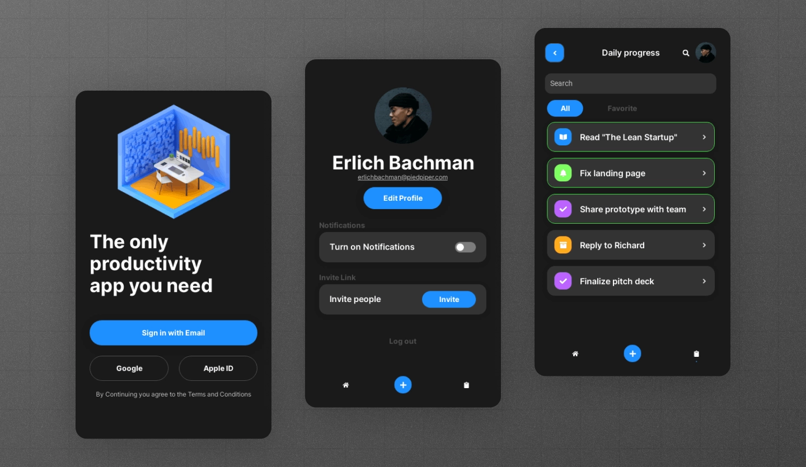
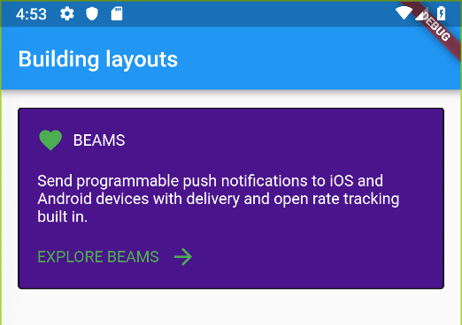

# Contoh Layout

## #1
Penjelasan lihat [Building layouts - Flutter](https://docs.flutter.dev/ui/layout/tutorial)

## #2

## #3

## #4
Penjelasan lihat [Building Complex layout](https://pusher.com/tutorials/flutter-building-layouts/#building-complex-layouts)
