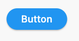
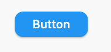
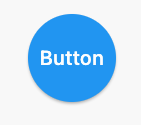
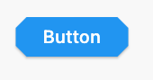

# ElevatedButton

```dart
ElevatedButton(
  onPressed: () {},
  child: Text('Button'),
  style: ElevatedButton.styleFrom(shape: StadiumBorder()),
)
```


---
```dart
ElevatedButton(
  onPressed: () {},
  child: Text('Button'),
  style: ElevatedButton.styleFrom(
    shape: RoundedRectangleBorder(
      borderRadius: BorderRadius.circular(12), // <-- Radius
    ),
  ),
)
```


---
```dart
ElevatedButton(
  onPressed: () {},
  child: Text('Button'),
  style: ElevatedButton.styleFrom(
    shape: CircleBorder(),
    padding: EdgeInsets.all(24),
  ),
)
```


---
```dart
ElevatedButton(
  onPressed: () {},
  child: Text('Button'),
  style: ElevatedButton.styleFrom(
    shape: BeveledRectangleBorder(
      borderRadius: BorderRadius.circular(12)
    ),
  ),
)
```


**Referensi**
- [StackOverFlow: Create a rounded button / button with border-radius in Flutter ](https://stackoverflow.com/questions/49991444/create-a-rounded-button-button-with-border-radius-in-flutter)
