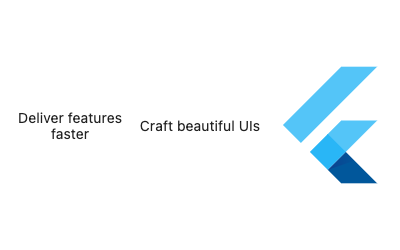

# Row

```dart
// Row, lebar masing-masing item dibagi merata
const Row(
  children: [
    Expanded(
      child: Text('Deliver features faster', textAlign: TextAlign.center),
    ),
    Expanded(
      child: Text('Craft beautiful UIs', textAlign: TextAlign.center),
    ),
    Expanded(
      child: FittedBox(
        child: FlutterLogo(),
      ),
    ),
  ],
)
```


---

```dart
// Row dengan kolom yang lebarnya dibagi menggunakan persentase
Row(
    children: <Widget>[
        Flexible(
            flex: 50, // 50%
            child: Container(
            color: Colors.cyan,
            alignment: Alignment.center,
            child: Icon(Icons.favorite),
            ),
        ),
        Flexible(
            flex: 50, // 50%
            child: Container(
            color: Colors.green,
            alignment: Alignment.center,
            child: Text('Hola'),
            ),
        ),
    ],
),
```