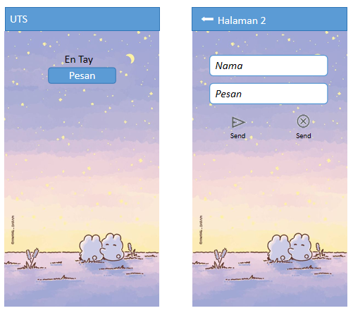

# Soal 1

Buat program seperti pada contoh di atas, dengan ketentuan seperti berikut:
1. Di halaman pertama, tulis nama Anda sebagai label
2. Ketika _Pesan_ diklik, buka _Halaman 2_
3. Gunakan _AppBar_ pada setiap halaman.
4. Copy hasil pekerjaan ke folder repository.