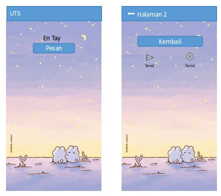

# Soal UTS

Buat program seperti pada contoh di atas, dengan ketentuan seperti berikut:
1. Di halaman pertama, tulis nama Anda sebagai label
2. Ketika _Pesan_ diklik, buka _Halaman 2_
3. Gunakan _AppBar_ pada setiap halaman.
4. Link gambar [https://ruang-belajar.github.io/dart-flutter/flutter/res/res-15.jpg](https://ruang-belajar.github.io/dart-flutter/flutter/res/res-15.jpg)
5. Copy hasil pekerjaan ke folder repository [(https://classroom.github.com/a/-z0d8AT2)](https://classroom.github.com/a/-z0d8AT2)