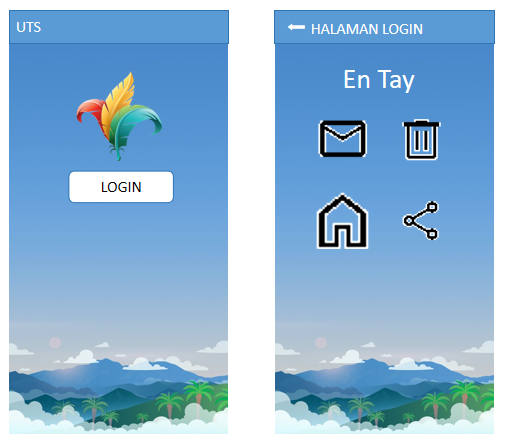

# Soal 2

Buat program seperti pada contoh di atas, dengan ketentuan seperti berikut:
1. Ketika _LOGIN_ diklik, buka _Halaman 2_
2. Gunakan _AppBar_ pada setiap halaman.
3. Di halaman LOGIN, tulis nama Anda sebagai label   
4. Copy hasil pekerjaan ke folder repository.

**Gambar:**

